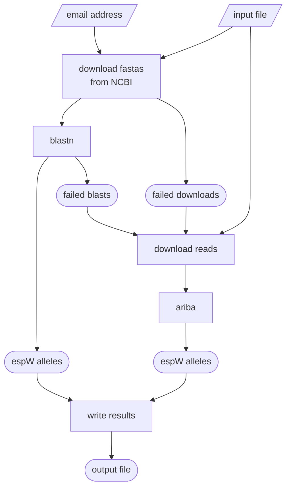

# PROJECT UNKINDNESS
Designing a tool for a group of ravens

#### Joseph S. Wirth, 2024

## Overview
### Background
Lorem Ipsum

### Workflow
Here is an overview of the workflow:


## Installation
### Installing `PROJECT UNKINDNESS` using a `conda` environment
download the two required git repositories
```bash
git clone https://github.com/ncezid-biome/BIOME-scripts.git
git clone https://github.com/dr-joe-wirth/project_unkindness.git
```
set up the environment
```bash
echo "MISC_DIR = '$(pwd)/BIOME-scripts/misc-python-scripts/'" > ./project_unkindness/miscDirectory.py
conda env create -f ./project_unkindness/environment.yml
conda activate unkindness
```

### Checking installation
Check the installation with the following command:

```bash
./project_unkindness/unkindness.py --check_env
```

If everything was installed correctly, the following message will be printed to screen:

```text

environment is suitable

```

## Running `PROJECT UNKINDNESS`
```text
PROJECT UNKINDNESS
    Joseph S. Wirth, 2024

usage:
    unkindness.py [-ireospqundhvc]

required arguments:
    -i, --in             [file] filename of a tab-separated file with three columns and no headers: key, ncbi accession, srr id
    -r, --reference      [file] filename of a reference file in fasta format
    -e, --email          [str] email address (used to query NCBI)

optional arguments:
    -o, --out            [file] filename to write the output (default: './espw_alleles.tsv')
    -s, --seq_dir        [directory] the directory where sequence files will be downloaded  (default: './seqs')
    -p, --pid            [float] the percent identity cutoff for blast (default: 90)
    -q, --qcov           [float] the query coverage cutoff for blast (default: 35)
    -u, --ungapped       perform blast with the `-ungapped` option (default: False)
    -n, --num_threads    [int] the number of threads to use for parallel processing (default: 1)
    -d, --delete         delete sequence files after finishing (default: False)

troubleshooting:
    -h, --help           print this help message
    -v, --version        print the version
    -c, --check_env      check that all dependencies are installed
```

## Software dependencies
* [ncbi-blast+](https://blast.ncbi.nlm.nih.gov/doc/blast-help/downloadblastdata.html)
* [sratoolkit](https://github.com/ncbi/sra-tools)
* [ARIBA](https://github.com/sanger-pathogens/ariba)
* [python3.9+](https://www.python.org/)
* [biopython](https://biopython.org/)
